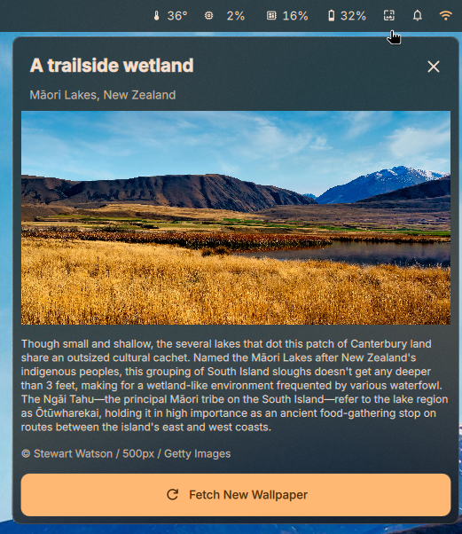

# Spotlight Wallpapers

DankMaterialShell widget that yoinks Windows Spotlight wallpapers for your desktop.

Microsoft has a lovely collection of wallpapers they politely reserve for Windows lock screens. I think they look great on an actual Linux desktop, so this widget politely asks their Spotlight API for the goods and, well... borrows them. (Sorry not sorry, Redmond.)

Click the widget → **Fetch New Wallpaper** → done. Metadata fetched via Qt's built-in `XMLHttpRequest`, image downloaded with `curl`, applied through `SessionData.setWallpaper()`.

Only external dependency: `curl`.
